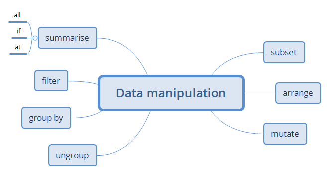

# Manipulación de Datos

## Contenidos temáticos

### Computación Científica

La **computación científica** es una disciplina que se 
enfoca en la aplicación de técnicas computacionales 
para resolver problemas científicos y de ingeniería. 
En particular, esta área se ocupa de desarrollar algoritmos,
métodos y herramientas de software para modelar, simular y 
analizar procesos físicos, químicos, biológicos y otros fenómenos
en diferentes campos de la ciencia.

La computación científica se utiliza en diversas áreas,
como la física, la química, la biología, la ingeniería,
la economía, la medicina, la meteorología y muchas otras. 
Por ejemplo, en física, la computación científica se utiliza 
para modelar sistemas complejos como el universo o los fenómenos 
cuánticos; en química, se utiliza para simular reacciones químicas;
en biología, se utiliza para analizar secuencias de ADN y 
para estudiar la estructura y función de proteínas; en ingeniería,
se utiliza para diseñar y optimizar sistemas complejos, como aviones
o automóviles.

### Manipulación de Datos

La **manipulación de datos** es el proceso de transformar o
modificar datos para extraer conocimientos o generar nueva
información a partir de ellos. Implica varias técnicas,
incluido el filtrado, la clasificación, la agregación, la limpieza,
la unión y la transformación de datos.

La manipulación de datos es
un paso esencial en el análisis de datos, 
ya que los datos sin procesar a menudo deben transformarse o
modificarse para extraer información significativa de ellos. 

Por ejemplo, en la limpieza de datos, los valores perdidos y los valores atípicos 
se eliminan o imputan para mejorar la calidad de los datos. En la agregación de
datos, los datos se agrupan y resumen para analizar patrones y tendencias. 

En la transformación de datos, las variables se modifican o crean para
generar nuevos conocimientos o hacer que los datos sean adecuados para un
análisis particular.

La manipulación de datos generalmente se 
realiza utilizando software especializado o lenguajes de programación como 
**SQL**, **Python**, **R** y **Excel**. 

Estas herramientas proporcionan una variedad de funciones y bibliotecas
integradas que hacen que la manipulación de datos sea más fácil y eficiente.

#### Data Tabular

La **data tabular**, también conocida como **datos estructurados**,
es un tipo de datos que se organiza en forma de tabla con filas y columnas.
Cada fila en la tabla representa un registro o una observación, mientras 
que cada columna representa una variable o un atributo.

Las tablas son una forma común de almacenar y
representar datos en muchas aplicaciones y sistemas, 
desde hojas de cálculo hasta bases de datos relacionales. 

La estructura de tabla facilita la organización y el
análisis de datos, ya que los datos se dividen en pequeñas
piezas que se pueden examinar y manipular individualmente.

Ejemplos comunes de datos tabulares incluyen:

* listas de ventas
* registros médicos
* datos de encuestas,
* tablas financieras
* registros de empleados
* etc.

### Visualización de Datos

La **visualización de datos** es una técnica que
consiste en representar información mediante gráficos, 
diagramas u otras formas de representación visual. 
El objetivo principal de la visualización de datos es
facilitar la comprensión de grandes conjuntos de datos y patrones ocultos en ellos.

La visualización de datos se utiliza 
en muchas áreas, como el marketing,
las finanzas, la salud, la ciencia y la tecnología. 
Por ejemplo, en el marketing, la visualización de
datos se utiliza para analizar el comportamiento del
consumidor y para identificar patrones en las ventas; 
en la salud, se utiliza para analizar la eficacia 
de tratamientos médicos; en la ciencia,
se utiliza para representar modelos matemáticos y para visualizar datos experimentales.

